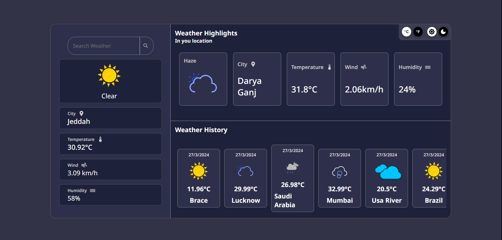

# Weather-Application-Dashboard

<h2>There are some images of WEATHER-DASHBOAD-APPLICATION in desktop view</h2>
<h3>Light Theme</h3>

<h3>Dark Theme</h3>

 

<h2>Technologies Used</h2>
<li>HTML</li>
<li>CSS</li>
<li>JavaScript</li>
<li>React</li>
<li>Material UI</li>
 

<h2>Features of this projects are given below:</h2>
<li>It provides a feature to <b>Search Weather by City Name</b>, and shows information such as
<dl>
  <dd><b>- Weather Type (Rain, Clear, Cloud, etc.)</b></dd>
  <dd><b>- City Name</b></dd>
  <dd><b>- Temperature</b></dd>
  <dd><b>- Wind Speed</b></dd>
  <dd><b>- Humidity</b></dd>
</dl>
</li>
<li>It shows the <b>User Weather Information</b> same as <b>Search Weather Information</b>, if user allowed <b>Location Access</b>.</li>
<li>It shows the <b>Searched Weathers History</b> which contans information such as
<dl>
  <dd><b>- Search Date</b></dd>
  <dd><b>- Weather Type</b></dd>
  <dd><b>- Temperature</b></dd>
  <dd><b>- City</b></dd>
</dl>
</li>
<li>It allows you to see <b>Temperature</b> in <b>Celsius or Fahrenheit</b>.</li>
<li>It allows you to see <b>Application</b> in <b>Dark or Light Theme</b>.</li>
<li>It changes it's <b>background</b> according to <b>Day Intervals</b> like Morning, Afternoon, Evening, Night.</li>
<li>It is <b>Fully Responsive</b>.</li>
 

   
  <li>Congratulations you run the application successfully</li>
   
   
  
</ol>
